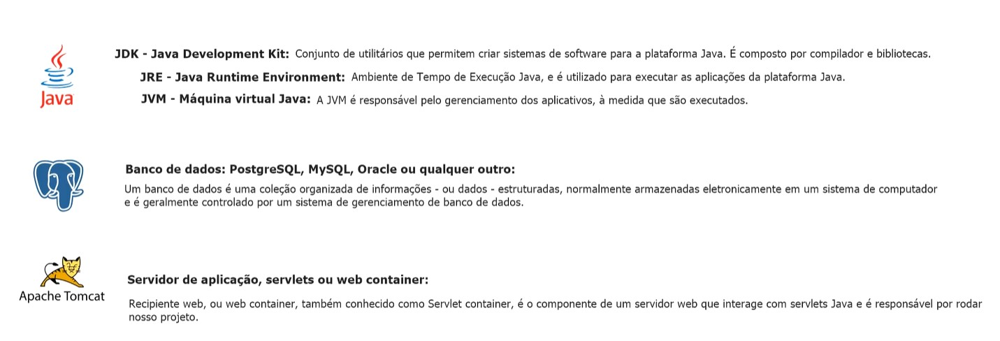

# Java Spring Boot Crud

Esse projeto consistirá em treinar os fundamentos utilizando o fremework Spring Boot, para refinamento dessas habilidades.

## Instalação

Eclipse IDE 2025

Apache Tomcat -> 10.1.50

PostrgresSql -> 9.5

Maven -> 3.9.11

#### Comandos via cmd, para matar processos fantasmas em caso de não fechamento correto via IDE:
tasklist | findstr javaw.exe

netstat -ano | findstr :8000

taskkill /IM javaw.exe /F

### Dependencia adicionada driver de conexão entre Maven e PostgresSql 9.5
### pom.xml
    <!-- https://mvnrepository.com/artifact/org.postgresql/postgresql -->
	<dependency>
	    <groupId>org.postgresql</groupId>
	    <artifactId>postgresql</artifactId>
	    <version>9.4.1212</version>
	</dependency>
